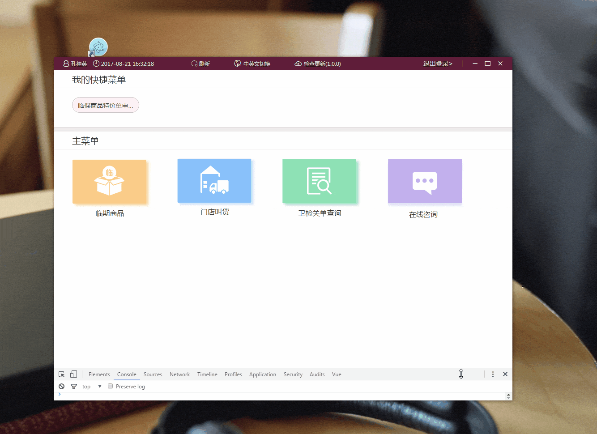

# electron + vue 实践项目

#### 本地安装环境准备

* 安装node： * https://nodejs.org/en/download/
* 配置webpack： npm install -g webpack(sudo权限)
* windows配置cnpm：

```bash
    npm install -g cnpm --registry=https://registry.npm.taobao.org
    因为npm的默认仓库在国外，下载很慢，国内淘宝搞了个CNPM，每10分钟同步一次，完全够用了
```

* 当然也可以使用yarn下载
```bash
    npm install -g yarn
    yarn install
```


#### 依赖包安装
* 进入项目目录
* 执行cnpm install

#### 安装问题
> * cnpm install之后，可能会由于网络不好而导致一些包安装不完整，这里推荐使用yarn进行安装
> * 需要额外安装vue-style-loader、vue-template-compiler，不然vue-loader会报错
> * electron配置项（config.js）为true时，运行npm run dev，浏览器访问会报错， `Uncaught ReferenceError: require is not defined
`，原因可以去[这里](https://github.com/egoist/vuepack/issues/83)看，由于配置config.electron是开启状态，于是require被browserified化了，不是原先node原生require函数，所以在browser会出现此问题
> * 应用打包的时候，需要注意package.json的main配置项main，必须指向electron的主线程文件，此处为app/index.js

#### 字体引入问题
对于webpack对于引入字体文件一直都会有问题，有时候你使用了file-laoder，url-loader，但是在使用还是会存在一些问题，比如渲染进程入口文件components/App.vue希望引入`common.scss`，`common.scss`会去`@import iconfont.css`(字体样式)，这时候`iconfont.css`的字体路径就会出现问题，webpack一直提示找不到依赖路径。在开发环境下，我是将iconfont.cn获取的字体文件远程地址写进build/index.html，这样解决了问题。正式环境下，可以将字体文件代码引入到App.vue文件中去

development:

```bash

$ npm run dev
# express开启服务，可以通过`http://localhost:port`访问（热重载）
# 原理：通过electron创建主体窗口，`mainWindow.loadURL(http://localhost:port)`，加载应用的 index.html

$ npm run app
# 运行`electron ./`,生成桌面应用

```

socket.io:

```bash

$ npm run socket

使用express + mongoDB + socket.io引入基于node的即时通讯模块

```


本地调试时，只需运行`npm run dev` **=>** `npm run app`，需要开启即时通讯的功能的需要`npm run sock`，这里需要注意即时通讯模块目前没有迁移至服务器，要在本地运行，需要使用express起一个服务（`./socket/`），这里的数据库集成使用的是mongoDB，所以必须要安装[mongoDB](https://www.mongodb.com/)，然后配置环境变量（比如说我安装的目录是`d:`，我的环境变量这样配置，`D:\Program Files\MongoDB\Server\3.4\bin`），这样之后，便可以使用`mongod`、`mongo`命令了，执行`mongod`命令，一般会报错，默认存储文档的目录没有，那可以这样，新建一个文件夹，用来存储mongo产生的文档对象，执行`mongod --dbpath D:\mongodb\db`


production:

```bash

$ npm run build
＃生成正式文件到app/dist目录（eletron应用目录）

```

package:

```bash

$ npm run package:mac
$ npm run package:win
$ npm run package:linux
$ npm run package

将上一步`npm run build`后生成的正式文件，进行打包，生成程序，打包至`./package`目录中

```


setup:

```bash

$ npm run setup

这里生成安装包（仅适合于window），将上一步生成的package，通过grunt和grunt-electron-installer完成打包，打包至`./package_dir`

```


生成安装包的过程：  
> * npm run build
> * npm run package:win（目前只支持window）
> * npm run setup

对于打包工具，这里使用的是`electron-packager`，安装命令：  

```
rimraf package && electron-packager . TEST --platform=win32 --arch=x64 --overwrite --icon=hosts.ico --out=./package --electron-version=1.6.11 --version-string.CompanyName=TEST --version-string.ProductName=TEST --ignore=\"(build|client$|static|theme|.gitignore|LICENSE|README.md|.editorconfig|.eslintrc|node_modules|gruntPackage.json|Gruntfile.js|yarn.lock|socket|package_dir|git_img)\"

```
参数：  
> * `.` => 应用目录
> * `TEST` => 应用名称
> * `--platform=win32` => 要打包的平台
> * `--overwrite` => 覆盖模式安装
> * `--icon=hosts.ico` => 应用图标（window时可以是`.ico`、`.png`，mac时可以为`.icns`）
> * `--out=./package` => 输出目录
> * `--electron-version` => electron版本
> * `--version-string.CompanyName=TEST --version-string.ProductName=TEST` => 为了生成安装包的时候，应用名字为`TEST`，而不是默认的`electron`
> * `--ignore=XXX` => 忽略打包的目录

详细可看[这里](https://github.com/electron-userland/electron-packager/blob/master/docs/api.md)


打包成安装程序，需要使用到`grunt`、`grunt-electron-installer`,请保证事先安装好  
在`package.json`设置：  
```
{
    "version": "1.0.0", // 这个是必须的，为了后面使用electron updater实现自动更新
    "productName": "my-electron",
    "description": "My Superb Vue Project For Electron",
    ......
}
```
Gruntfile.js文件如下[详细](https://www.npmjs.com/package/grunt-electron-installer)：  
```
var grunt = require('grunt')

// 配置
grunt.config.init({
    pkg: grunt.file.readJSON('package.json'), // 这里会去获取版本号
    'create-windows-installer': {
        x64: {
            authors: 'xiaobinwu <xiaobin_wu@yahoo.com>', // 作者
            projectUrl: '',
            appDirectory: './package/TEST-win32-x64', // 要打包的输入目录
            outputDirectory: './package_dir', // grunt打包后的输出目录
            exe: 'TEST.exe', // 生成的exe文件
            description: 'My Superb Vue Project For Electron',
            setupIcon: './app/hots.ico', // 图标
            noMsi: true // 是否生成.msi
        }
    }
})

// 加载任务
grunt.loadNpmTasks('grunt-electron-installer')

// 设置为默认
grunt.registerTask('default', ['create-windows-installer'])

```
于是就会生成如上图所示的`my-electronSetup.exe`，点击运行，进入一个安装的过程，会有安装的小动画，如下图：  


lint:

```bash

$ npm run lint
# lint项目（配置规则：.eslintrc）

```
> 上面的npm run script命令可能有些多，涉及的内容也比较多，文章后面会一一讲解！下面上一波效果图：





---

Generated by [VuePack](https://github.com/egoist/vuepack).
vuePack [Issue](https://github.com/egoist/vuepack/issues)

